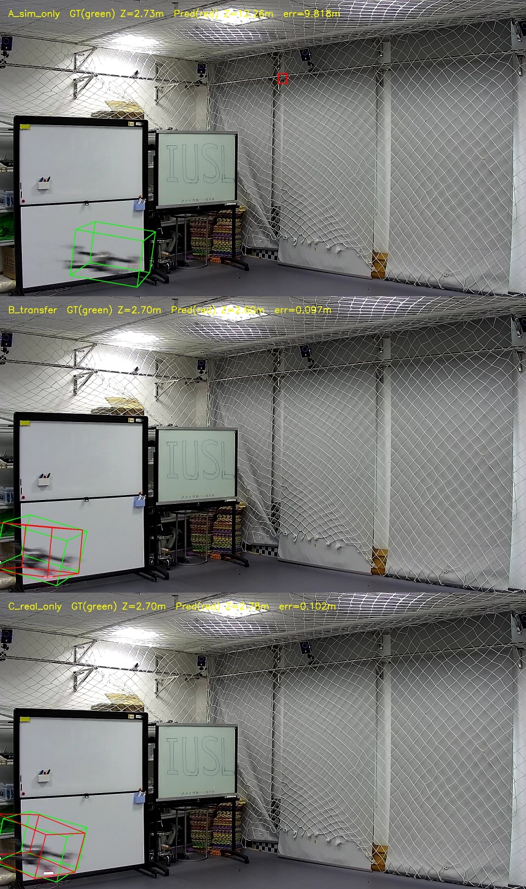
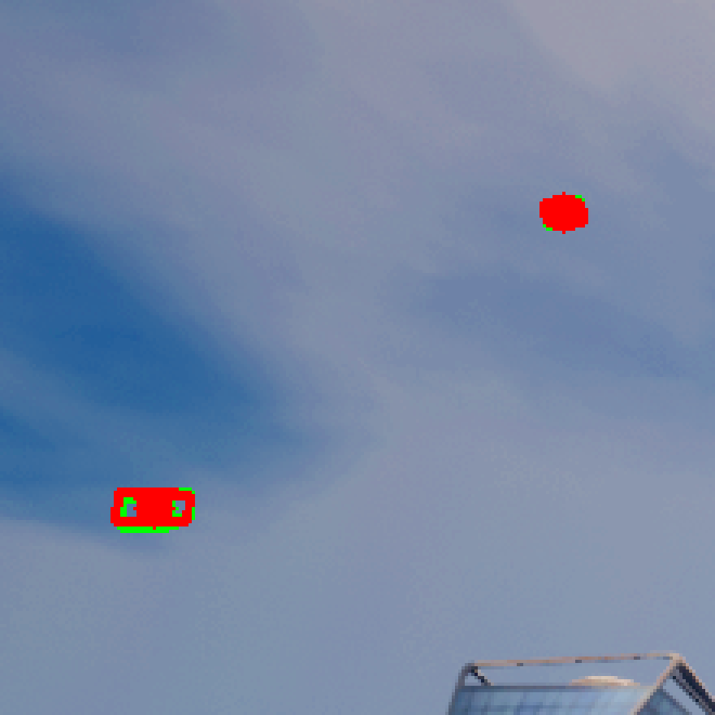
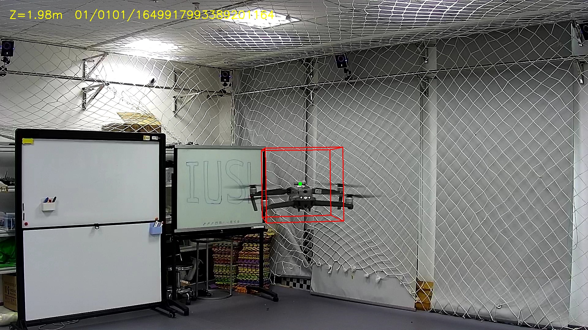
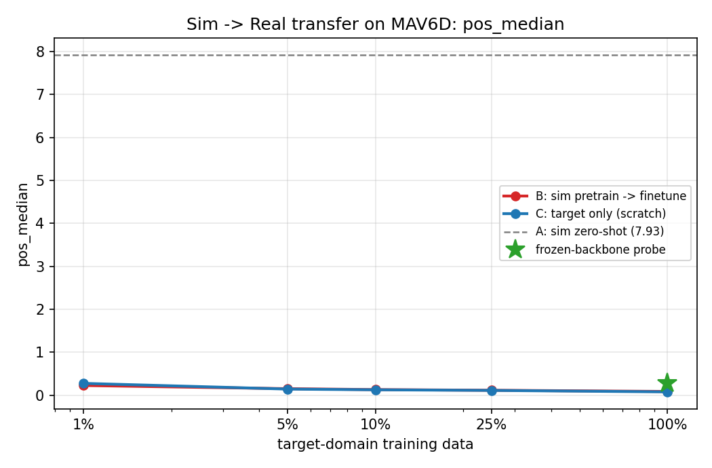
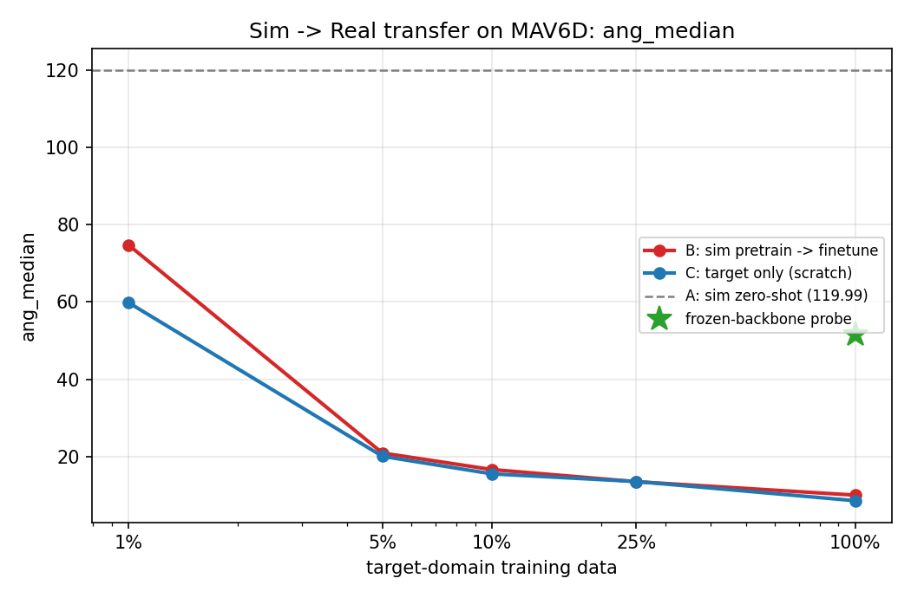
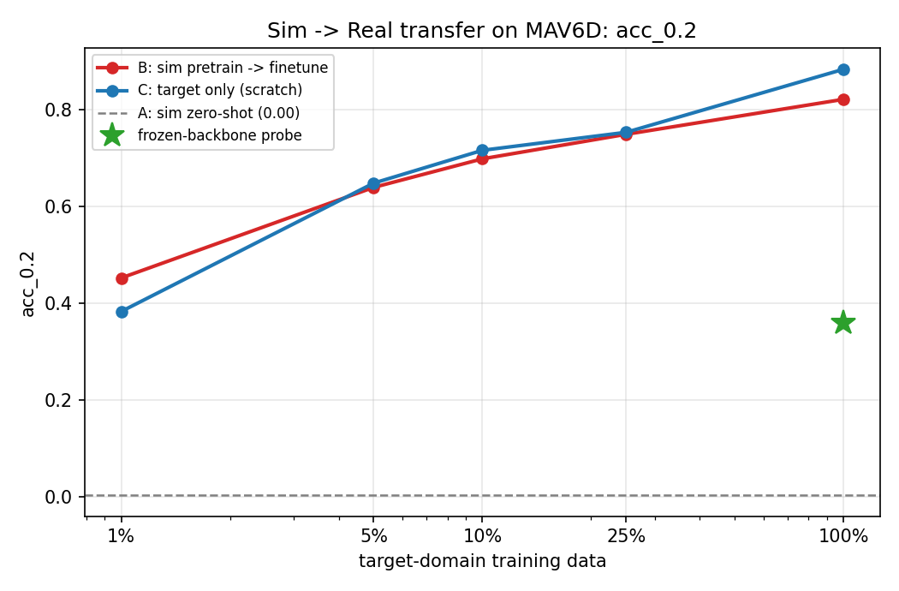

# Sim → Real 迁移实验结果

三臂对比，全部在**同一个 MAV6D 测试集**（4,800 帧，mavic2 1,290 + phantom4 3,510）上，
用同一个评测器 `tools/eval_on_mav6d.py`、同一套**类别无关**的位姿误差指标
（每帧取置信度最高的检测，与 GT 比位置/深度/旋转）。

各臂的 `hm` 通道数不同（仿真 7 类 vs MAV6D 2 类），无法直接用各自配置里的评测流程
横向比，所以统一成上面这套指标。

## 三个臂

| 臂 | 训练数据 | 权重来源 |
|---|---|---|
| **A 纯模拟** | 仅仿真 near15（8,773 帧）| 直接零样本推理，不碰任何真实数据 |
| **B 迁移** | 仿真预训练 → MAV6D 微调（15,202 帧）| 载入 A 的权重，96.9% 张量可迁 |
| **C 纯真实** | 仅 MAV6D（15,202 帧）| 随机初始化 |

B 与 C 除初始化外**完全相同**：同配置、同数据、同超参、同 15 轮、并行运行以保证资源对等。

## 结果

| 指标 | A 纯模拟 | B 迁移 | C 纯真实 |
|---|---|---|---|
| 位置误差 中位 (m) | 7.925 | 0.084 | **0.075** |
| 位置误差 均值 (m) | 6.151 | 0.121 | **0.102** |
| 深度误差 中位 (m) | 7.662 | 0.080 | **0.072** |
| 角度误差 中位 (deg) | 119.99 | 10.005 | **8.561** |
| 角度误差 均值 (deg) | 127.04 | 15.541 | **13.018** |
| 位置误差 < 0.1 m | 0.2% | 56.5% | **61.5%** |
| 位置误差 < 0.2 m | 0.4% | 82.1% | **88.4%** |
| 位置误差 < 0.5 m | 1.1% | 98.0% | **99.4%** |
| 有效检测 | 4140/4800 | 4788/4800 | 4783/4800 |
| 训练末 loss | — | 0.312 | 0.313 |

GT 深度范围 1.54 ~ 5.55 m（中位 3.38）。



上中下依次为 A / B / C，绿框 = GT，红框 = 预测。

## 结论

### 1. 仿真零样本完全不可用

A 的位置误差中位 **7.9 m**，比整个 GT 深度范围（1.5–5.6 m）还大；角度误差 **120°**
接近随机取向的期望值。可视化中它把目标定位到画面上方的安全网上，深度预测 12.3 m
而真值 2.7 m —— 输出的基本是源域先验（≤15 m 的中段深度），与真实场景无对应关系。

**这给迁移提供了明确的下限：不做任何适配，仿真训练的模型在真实域上是无效的。**

### 2. 在当前设置下，迁移没有增益，反而略差

B 在所有指标上都比 C 差一点（位置 +12%，角度 +17%），两者训练末 loss 几乎相同
（0.312 vs 0.313），说明收敛到了同一水平。

判断原因是**目标域数据太充足**：MAV6D 有 15,202 训练帧，而任务本身相对简单
（单目标、静止相机、深度范围仅 1.5–5.6 m）。数据足够时从零训完全能学好，
而仿真先验（室外、几十米、1.3 m 大目标、CARLA 渲染风格）反而构成负迁移。

**这不否定对齐工作的价值**：96.9% 的权重能成功迁入，证明模态 / 骨干 / 检测头 /
深度尺度 / 旋转约定五个维度确实已经对齐（详见主 README 的「跨域对齐」一节）。
只是在"目标域数据充足"这一条件下，迁移本身不产生收益。

### 3. 待补：低数据量下的对比

迁移学习真正的用武之地是目标域数据稀缺时，而当前设置恰好绕开了这个场景。
下一步应把 MAV6D 训练集降采样到 1% / 5% / 10% / 25% 重跑 B vs C：

- 若曲线在低数据端分开，说明预训练的价值被充足数据掩盖了
- 若全程重合，则是真的负迁移，需要换预训练策略（只迁 backbone、或改用更接近的源域）


## 补充：仿真模型在**仿真域内**的表现（关键诊断）

A 在真实域失败后，必须回答一个问题：**是模型不行，还是域间隙的锅？**
于是把同一个权重放回仿真测试集（near15 test，2,361 帧）用仓库原生的 ADS 指标评测。

| 类别 | 位置误差 中位 (m) | 角度误差 中位 (deg) | ADS (%) |
|---|---|---|---|
| DJI-mavic-mini | 0.520 | 3.56 | **69.41** |
| DJI-avata2 | 0.392 | 7.08 | 67.94 |
| matrix-300-RTK | 0.497 | 3.14 | 65.01 |
| m210-rtk | 0.530 | 1.17 | 64.95 |
| drone-unk3 | 0.629 | 2.42 | 64.64 |
| DJI-phantom4 | 0.680 | 5.44 | 60.32 |
| Matrice-600-Pro | 2.647 | 18.73 | 27.94 |



红框(预测)几乎完全盖住绿框(GT)，只有边缘露出绿色。

**结论：模型和训练都没问题。** 在仿真域内，位置误差中位 0.39–0.68 m（目标距离可达 15 m）、
角度误差 1.2–7.1°，ADS 60–69%，是正常可用的水平。

所以 A 在 MAV6D 上位置误差 7.9 m、角度 120°，**完全是域间隙造成的，不是模型能力问题**。
这条诊断把"仿真零样本不可用"的原因钉死在了域差异上。

### Matrice-600-Pro 的异常：一个配置 bug

该类 ADS 只有 27.94（其他类 60-69），位置误差 2.65 m（其他类约 0.5 m）。追查结果是
**近距离子集配置里 `MAX_SIZE` 设错了**。

`dim` 头的监督值是 `GT尺寸 / MAX_SIZE`。实测（采样 975 帧）GT 尺寸分布：

| | 中位 | 95% | 最大 |
|---|---|---|---|
| 全类别 | 0.68 m | 1.47 m | **2.63 m** |

| 机型 | 最大尺寸 |
|---|---|
| Matrice-600-Pro | **2.63 m** |
| matrix-300-RTK | 1.60 m |
| m210-rtk | 1.30 m |
| 其余四类 | <= 0.83 m |

near8/near15 配置里 `MAX_SIZE` 曾被设为 **2**，于是 Matrice-600-Pro 的归一化目标
达到 `2.14 / 2 = 1.07`，**超出了 [0,1] 范围**，该类的尺寸回归因此失准。

误设的原因是把 `OB_SIZE: [[1.3, 1.3, 1.3]]` 当成了实际目标尺寸。但在 LAAM6D 路径里
**`OB_SIZE` 不参与任何监督** —— 它只是被透传进 `frame_dict['obj_size']` 当元数据；
`dim` 的真值来自标注 8 角点在物体坐标系下的极差
（`convert_9points_to_9params` 里算出的 `l/w/h`）。

已改回与基配置 `laam6d.yaml` 一致的 `MAX_SIZE: 4`（安全覆盖 2.63 m）。
**其余六类不受影响**（尺寸都远小于 2），所以三臂对比的整体结论不变；
但源域模型若要在 Matrice-600-Pro 上取得正常表现，需要用修正后的配置重训。

### 复现

```bash
# 原生 ADS 指标
python tools/test.py --cfg_file cfgs/models/uavdet_3d/laam6d/centerdet_rgb_near15.yaml \
    --batch_size 8 --workers 4 --ckpt <sim_ckpt>.pth

# 仿真域可视化（--zoom 会额外裁一张放大图，仿真里目标只有几十像素）
python tools/vis_sim_pred.py --ckpt <sim_ckpt>.pth --num 4
```

## 数据本身的验证



`tools/mav6d_prepare.py check` 在 20,002 帧上的结论：

| | mavic2 | phantom4 |
|---|---|---|
| 图 / 标签配对 | 10001 / 10001，零缺失零多余 | 10001 / 10001，零缺失零多余 |
| 深度范围（中位）| 0.76–5.55 m（3.25）| 1.57–5.72 m（3.47）|
| GT 投影落在画面内 | **100.0%** | **99.9%** |
| 相机位姿波动 | 0.41 mm / 0.466° | 0.61 mm / 0.563° |
| 折算到中位深度的位置偏差 | 26.8 mm | 34.8 mm |

相机位姿波动折算后相对 340 mm 的目标尺寸约 10%，可忽略 ——
`read_truth_Rt` 里那个**写死的 camera→VICON 外参对两个型号都成立**。

## 复现

```bash
# A 纯模拟（零样本）
python tools/eval_on_mav6d.py --ckpt <sim_ckpt>.pth --tag A_sim_only --decode-max-dis 15 --vis 4

# B 迁移
python tools/train.py --cfg_file cfgs/models/uavdet_3d/mav6d/centerdet.yaml \
    --batch_size 8 --workers 4 --epochs 15 \
    --pretrained_model <sim_ckpt>.pth --pretrained_skip hm --pretrained_src_max_dis 15 \
    --set DATA_CONFIG.DATA_PATH <MAV6D_ROOT>
python tools/eval_on_mav6d.py --ckpt <B_ckpt>.pth --tag B_transfer --vis 3

# C 纯真实
python tools/train.py --cfg_file cfgs/models/uavdet_3d/mav6d/centerdet.yaml \
    --batch_size 8 --workers 4 --epochs 15 \
    --set DATA_CONFIG.DATA_PATH <MAV6D_ROOT>
python tools/eval_on_mav6d.py --ckpt <C_ckpt>.pth --tag C_real_only --vis 3
```

源域预训练（产出 `<sim_ckpt>`）：30 轮，loss 448 → 0.335，单卡 RTX 5090 Laptop 约 4.5 小时。

```bash
python tools/train.py --cfg_file cfgs/models/uavdet_3d/laam6d/centerdet_rgb_near15.yaml \
    --batch_size 8 --workers 4 --epochs 30 --logger_iter_interval 20 \
    --set DATA_CONFIG.DATA_PATH <data_collect>
```

---

# 低数据量迁移曲线（主结果）

三臂在 100% 数据下几乎重合，无法判断迁移到底有没有用——迁移的价值只在目标域数据稀缺时
体现。于是把 MAV6D 训练集等间隔降采样到 1% / 5% / 10% / 25%，B 与 C 各重跑一遍。
协议见 [../benchmark/README.md](../benchmark/README.md) §5.2。

## 位置误差 中位（m，越小越好）

| 目标域数据 | 帧数 | B 迁移 | C 从零 | B 的增益 |
|---|---|---|---|---|
| **1%** | 152 | **0.2237** | 0.2729 | **+18.0%** |
| 5% | 760 | 0.1488 | **0.1404** | −5.9% |
| 10% | 1,520 | 0.1275 | **0.1238** | −3.0% |
| 25% | 3,800 | 0.1120 | **0.1092** | −2.5% |
| 100% | 15,202 | 0.0842 | **0.0753** | −11.7% |



## 角度误差 中位（度，越小越好）

| 目标域数据 | B 迁移 | C 从零 | B 的增益 |
|---|---|---|---|
| 1% | 74.75 | **59.82** | −25.0% |
| 5% | 20.90 | **20.05** | −4.2% |
| 10% | 16.63 | **15.51** | −7.2% |
| 25% | **13.47** | 13.53 | +0.4% |
| 100% | 10.01 | **8.56** | −16.9% |




**唯一的增益是 1% 数据下位置误差 +18%，其余全线持平或负迁移，朝向几乎全程负迁移。**
从 760 帧起从零训练就已经反超——760 帧对这个单场景目标域完全够用。

---

# 冻结骨干探针：源域特征到底有没有价值

零样本失败（7.925 m）之后要回答的问题是：**是特征不行，还是微调协议把预训练洗掉了？**
把骨干（84.7% 参数）冻死、只训检测头，就能测出「源域特征本身」的上限。

关键是必须有**随机初始化的冻结骨干**作对照——MAV6D 是单场景，
说不定随机特征加一个训练好的头也够用。

| | 位置误差 中位 | 角度误差 中位 | < 0.2 m | 有效检测 | 训练末 loss |
|---|---|---|---|---|---|
| A 纯仿真零样本 | 7.925 m | 119.99° | 0.4% | 4140/4800 | — |
| **P-sim** 冻结**源域**骨干 | 0.279 m | **51.64°** | 36.0% | 4542/4800 | 0.752 |
| **P-rand** 冻结**随机**骨干 | **0.256 m** | 63.97° | **40.0%** | 4635/4800 | **0.514** |
| C 纯真实（全网络） | 0.075 m | 8.56° | 88.4% | 4783/4800 | 0.315 |

## 结论（含一处更正）

**随机初始化的冻结骨干在位置上反而比仿真预训练的更好**（0.256 vs 0.279 m，
< 0.2 m 命中率 40.0% vs 36.0%），训练损失也更低（0.514 vs 0.752）。

因此**「仿真特征本身是有用的」这个说法不成立**——0.279 m 反映的是
**MAV6D 窄到连随机特征都够用**，不是源域特征的质量。
（本文档早先版本据此下过相反的结论，已更正。）

仿真预训练唯一真正贡献的是**旋转相关的特征**：P-sim 的角度误差 51.64° 明显优于
P-rand 的 63.97°。但这与全网络微调下「朝向几乎全程负迁移」正好相反——
冻结时检测头修不了坏特征，任何结构都算有用；全量微调时源域的姿态分布先验反而成了包袱。

## 最可能的原因不是「仿真没用」，而是尺度没对齐

源域权重是在 640×384 上训的，探针却在 512×256 上用，而两个域的表观大小本来就差
**2.84 倍**（见 benchmark 文档 §3.1）。也就是说这些特征是在它从未见过的尺度上被使用的。

这把下一步钉死了：**先做角尺度 + 内参对齐，再重训源域，然后重跑零样本与探针。**
角尺度子集已经建好（`cfgs/subsets/angsize`，3,012 训练帧）。
如果对齐后零样本从 7.9 m 显著下降，就说明这个 sim2real 任务的主轴是尺度而非外观——
那是一个能写成方法贡献的结论；如果没有变化，则说明需要真正的域适配方法。

---

# 第二版：修好代码后重跑 B/C（负面结果）

针对审计发现的问题做了三处修改，重跑低数据量对比。变量分成两类以便归因：

**两边都改**（模型修正）：`ROT_REPR=r6d`（6D 连续旋转表示）+ 前景掩码改用 `center_dis > 0`
**只改 B**（被检验的迁移协议修正）：`--backbone_lr_mult 0.1`、`--freeze_epochs`（前约 10%
迭代冻结骨干）、`--pretrained_skip hm rot`（源域 rot 头是 euler6 训的，语义不同）

`LOSS_WEIGHTS` 保持缺省 1.0 未动。轮数与第一版完全一致。

## B2 vs C2

| 目标域数据 | B2 迁移 | C2 从零 |
|---|---|---|
| 1%（152 帧） | 0.403 m / 82.15° | **0.268 m / 69.62°** |
| 5%（760 帧） | 0.247 m / 49.14° | **0.152 m / 30.93°** |
| 10%（1,520 帧） | 0.191 m / 39.30° | **0.113 m / 24.61°** |
| 25%（3,800 帧） | 0.159 m / 35.58° | 未评测 |

**迁移臂全线大幅落后**，比第一版的朴素微调还差得多
（第一版 B 在 1% 时是 0.224 m，还领先 C 的 0.273 m）。

## C2 vs C：r6d + 掩码修正的独立消融

这两个只差 `ROT_REPR` 与掩码，是干净对照：

| 目标域数据 | 位置 旧 → 新 | 角度 旧 → 新 |
|---|---|---|
| 1% | 0.273 → 0.268 m | 59.82° → **69.62°** |
| 5% | 0.140 → 0.152 m | 20.05° → **30.93°** |
| 10% | 0.124 → 0.113 m | 15.51° → **24.61°** |

**位置基本持平，角度全线变差 1.5–2 倍。**

## 结论

### 1. 「保护预训练权重」在这个域对上是反效果

分层学习率与渐进解冻的作用是让骨干停在预训练解附近。但冻结骨干探针已经证明
**仿真特征不优于随机特征**（0.279 vs 0.256 m），所以"保护"等于把模型锁死在一个
没有价值的初始化上。

反过来看：第一版朴素微调之所以还能用，**正是因为 LR 1e-3 全网络解冻在 200 步内
就摧毁了仿真初始化**。把这个"缺陷"修好，反而堵死了唯一的出路。

**标准迁移学习的直觉在这里失效，因为那个直觉的前提是源域特征有用。**
这条观察本身可以写进论文：当源域特征价值为零时，迁移方法的设计目标应当反转。

### 2. r6d + L1 损失在这个任务上更差

只有实验事实，原因尚未验证。一个待检验的解释：MAV6D 的姿态接近 SO(3) 上均匀分布，
而 L1 损失的最优解是目标分布的中位数 —— r6d 的中位向量接近零向量，
Gram-Schmidt 之后是任意旋转；euler6 至少每个轴还能给出确定角度。数据越少差别越大。
若要继续这条线，应先换成 L2 或测地损失再测，不能只凭现在的证据否定 6D 表示本身。

### 3. 下一步应该动源域，而不是微调协议

问题在特征本身没有价值，调微调协议是治标。方向仍然是尺度对齐重训
（角尺度子集已建好，见 benchmark 文档 §2 与 §3.1）。

## 未完成的部分

- **100% 档（B2_full / C2_full）训练到第 7–8 轮被手动中止**，onecycle 学习率未退火完，
  中途权重不可比，故不报告。
- **C2_p25 未评测**（一次约 4 分钟的评测即可补上）。

这两项都不影响上面的结论 —— 趋势在 1%/5%/10% 三档上已经完全一致。
